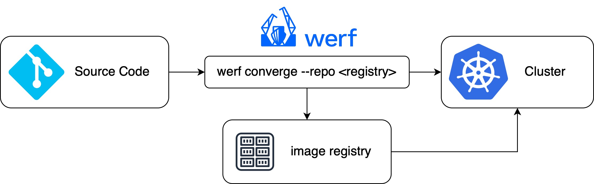

Let's go ahead and run werf for the first time. Make sure you are in the `demo-app/` folder. `pwd`{{exec}}.
Start the command now, it will take some time:

`werf converge --repo localhost:5000/demo-app`{{exec}}

`werf converge --repo <registry>/<image>` 

The `--repo` command is actually about specifing the registry and the image we use for our deployment.

Now werf starts by building our application from the Dockerfile(s) that we specified in `werf.yml`.
Next it will upload the images into the registry as specified in the `--repo` option.
Now that we have fresh images to deploy werf will update the manifest files to use the newest images.
In this stage this variable - `image: {{ .Values.werf.image.demoapp }}` - from the `deployment.yml` is resolved.
Now that the configuration files are ready werf will apply them to the local Kuberentes cluster.

> *Notes on the image registry*: In order to avoid a login to dockerhub or any other cloud registry we are running a local image registry here in our instance at `localhost:5000`. This registry is accessed via http instead of https, this is why we have specified in the previous step that werf is allowed to use an insecure registry.

# Explore

Take some time to explore what was actually deployed:

`k --namespace demo-app get deployments`{{exec}}

You can see that our service is listening to external requests on port `30081`:

`k --namespace demo-app get services`{{exec}}

Werf pushes every build that it has created to the same image in the registry, differentiating them by tags.
Check out the images in the local registry by running:

`curl -X GET http://localhost:5000/v2/_catalog`{{exec}}

Check out the tags for this image by running:

`curl -X GET http://localhost:5000/v2/demo-app/tags/list`{{exec}}

# Check out the application

Now access our demo app via:

[ACCESS DEMO APP]({{TRAFFIC_HOST1_30081}})

or here by entering port: `30081`

[ACCESS PORTS]({{TRAFFIC_SELECTOR}})